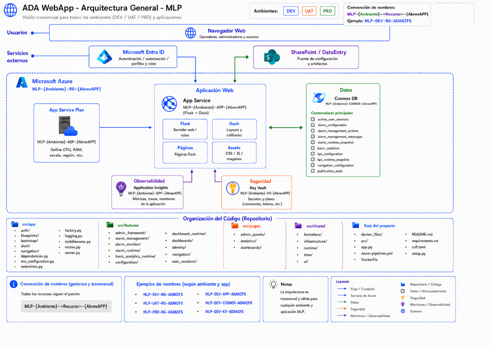

# Arquitectura Web

## Propósito

Este documento describe la arquitectura de la WebApp Flask + Dash utilizada por ADA WebApp. Su foco es explicar cómo se organizan las capas principales, qué responsabilidades tiene cada componente y cómo se relaciona la aplicación web con los servicios externos y recursos Azure.

Este documento no cubre instalación local, variables de entorno, despliegue, troubleshooting ni convenciones generales de desarrollo. Esos temas se documentan en archivos separados dentro de `/docs`.

## Límite arquitectónico

La WebApp representa la capa visual e interactiva del ecosistema ADA. Su responsabilidad principal es servir páginas, dashboards, paneles administrativos, vistas de alarmas, navegación, identidad visual y analítica básica.

La WebApp no debe ejecutar procesos pesados de ingesta, cálculo, compactación o transformación intensiva. Esos procesos pertenecen a componentes backend externos. La aplicación web consume información ya preparada, publicada o lista para renderizar.

Responsabilidades dentro del límite de la WebApp:

* servir Flask como aplicación base;
* montar Dash como capa visual;
* exponer páginas y rutas;
* registrar callbacks;
* resolver identidad, perfil y navegación;
* consultar configuración publicada;
* consultar snapshots runtime;
* renderizar dashboards, alarmas, administración y analítica;
* servir assets estáticos;
* emitir trazas, métricas y logs.

Responsabilidades fuera del límite de la WebApp:

* ingesta de datos crudos;
* procesamiento pesado de KPIs;
* ejecución del motor backend de alarmas;
* compactación de datos;
* generación batch de snapshots;
* publicación externa de artefactos fuera del flujo definido.

## Vista general



La arquitectura se organiza en cuatro zonas principales:

| Zona                    | Descripción                                      |
| ----------------------- | ------------------------------------------------ |
| Usuarios                | Acceso mediante navegador web.                   |
| Servicios externos      | Identidad y configuración administrable.         |
| Microsoft Azure         | Alojamiento, datos, seguridad y observabilidad.  |
| Organización del código | Estructura interna del repositorio Flask + Dash. |

## Capas de la arquitectura

### 1. Capa de usuario

El usuario accede a la aplicación mediante navegador web. Desde esta capa se consumen las páginas Dash, dashboards, paneles administrativos, vistas de alarmas y módulos de analítica.

La WebApp debe entregar una experiencia visual centralizada sin exponer detalles internos de infraestructura, Cosmos DB, SharePoint/DataEntry o servicios de backend.

### 2. Capa de identidad

Microsoft Entra ID entrega autenticación, autorización, perfiles y roles.

La WebApp utiliza esta información para:

* identificar al usuario;
* resolver su perfil funcional;
* filtrar navegación disponible;
* controlar acceso a páginas;
* habilitar o restringir acciones administrativas.

La identidad no debe resolverse manualmente desde callbacks aislados. Debe integrarse como parte de la capa transversal de autenticación y contexto de usuario.

### 3. Capa de configuración externa

SharePoint/DataEntry actúa como fuente administrable de configuración y artefactos funcionales.

Desde esta capa pueden provenir artefactos como:

* configuración de navegación;
* catálogos funcionales;
* configuración de alarmas;
* configuración de KPIs;
* mensajes administrables;
* parámetros editables por usuarios autorizados.

La WebApp puede leer o escribir configuración según el flujo definido, pero no debe tratar Cosmos DB como fuente manual primaria cuando SharePoint/DataEntry sea la fuente oficial.

### 4. Capa de aplicación web

La aplicación corre sobre Azure App Service y se compone internamente de Flask + Dash.

Dentro del App Service conviven cuatro responsabilidades principales:

| Bloque | Responsabilidad                                                       |
| ------ | --------------------------------------------------------------------- |
| Flask  | Servidor web, rutas, middlewares, autenticación y configuración base. |
| Dash   | Layouts, callbacks, páginas e interacción visual.                     |
| Pages  | Definición de páginas navegables.                                     |
| Assets | CSS, JavaScript, imágenes, iconos y recursos estáticos.               |

El App Service es el centro operativo de la WebApp. Desde ahí se consultan servicios externos, se resuelve configuración, se ejecutan callbacks y se renderizan las respuestas hacia el navegador.

### 5. Capa de capacidad de alojamiento

El App Service Plan define la capacidad sobre la que corre el App Service.

Su responsabilidad es entregar:

* CPU;
* memoria;
* región;
* escalabilidad;
* características del hosting;
* límites operativos de ejecución.

El App Service Plan no contiene lógica funcional. Su relación principal es proveer la capacidad de ejecución del App Service.

### 6. Capa de ejecución Gunicorn

La WebApp se ejecuta mediante Gunicorn usando la configuración definida en:

```text
gunicorn.config.py
```

Gunicorn actúa como servidor WSGI para levantar la aplicación Flask + Dash dentro del contenedor o del App Service.

Configuración base:

| Parámetro      | Valor          | Rol                                                    |
| -------------- | -------------- | ------------------------------------------------------ |
| `bind`         | `0.0.0.0:8000` | Expone la aplicación dentro del contenedor.            |
| `worker_class` | `gthread`      | Usa workers con threads para manejar concurrencia.     |
| `loglevel`     | `info`         | Define nivel de logging de Gunicorn.                   |
| `timeout`      | `90`           | Tiempo máximo antes de considerar un worker bloqueado. |
| `keepalive`    | `5`            | Tiempo de keep-alive para conexiones persistentes.     |

La cantidad de workers y threads depende de la variable de entorno:

```text
FLASK_ENV
```

Configuración actual:

| `FLASK_ENV` | Workers | Threads | Uso esperado                                                                         |
| ----------- | ------: | ------: | ------------------------------------------------------------------------------------ |
| `DEV`       |       1 |       2 | Ambiente de desarrollo desplegado.                                                   |
| `UAT`       |       3 |       2 | Ambiente de validación con mayor concurrencia.                                       |
| Otro valor  |       1 |       2 | Valor por defecto para `LOCAL`, `PROD` u otros valores no declarados explícitamente. |

Actualmente `UAT` usa `3` workers y `2` threads. Existe una nota técnica para evaluar en refactorización si corresponde subir a `4` threads.

Esta configuración afecta directamente la capacidad de atención concurrente de la WebApp. Por eso, `FLASK_ENV` no solo identifica el ambiente lógico, también impacta el comportamiento runtime de Gunicorn.

Si se requiere una configuración específica para `PROD`, debe declararse explícitamente en `gunicorn.config.py`, evitando que producción caiga en el bloque genérico `else` por accidente.

### 7. Capa de datos runtime

Azure Cosmos DB representa la persistencia runtime y publicada que la WebApp necesita consultar de forma rápida.

Contenedores principales:

| Contenedor                  | Responsabilidad arquitectónica                  |
| --------------------------- | ----------------------------------------------- |
| `active_user_sessions`      | Estado de sesiones activas o recientes.         |
| `alarm_configuration`       | Configuración funcional de alarmas.             |
| `alarm_management_actions`  | Acciones de gestión realizadas desde la WebApp. |
| `alarm_management_messages` | Mensajes configurables para gestión de alarmas. |
| `alarm_runtime_snapshot`    | Snapshot de alarmas listo para renderizar.      |
| `basic_analytics`           | Datos agregados para analítica básica.          |
| `kpi_configuration`         | Configuración funcional de KPIs.                |
| `kpi_runtime_snapshot`      | Snapshot de KPIs listo para renderizar.         |
| `navigation_configuration`  | Configuración publicada de navegación.          |
| `publication_state`         | Estado de publicación de artefactos.            |

Cosmos DB debe entenderse como una capa de consulta runtime para la WebApp. No debería concentrar lógica pesada ni convertirse en una fuente manual paralela de configuración.

### 8. Capa de seguridad

Azure Key Vault centraliza secretos y referencias sensibles.

La WebApp debe resolver desde esta capa:

* claves;
* connection strings;
* tokens;
* secretos de servicios;
* parámetros protegidos.

El código fuente no debe contener secretos productivos ni valores sensibles hardcodeados.

### 9. Capa de observabilidad

Application Insights y Log Analytics entregan monitoreo, trazabilidad y diagnóstico.

La observabilidad apunta principalmente al App Service, porque ahí se ejecutan Flask, Dash, callbacks, rutas y servicios internos.

Debe permitir analizar:

* errores de aplicación;
* excepciones en callbacks;
* trazas de ejecución;
* tiempos de respuesta;
* eventos relevantes;
* disponibilidad;
* comportamiento operacional.

## Arquitectura interna del repositorio

La WebApp se organiza en cuatro capas principales dentro de `src`.

```text
src/
├── app/
├── features/
├── pages/
└── shared/
```

### `src/app`

Capa de inicialización y bootstrap de la aplicación.

Responsabilidades:

* crear la aplicación Flask;
* inicializar Dash;
* registrar rutas;
* configurar middlewares;
* inicializar servicios globales;
* exponer dependencias;
* registrar callbacks y layouts;
* resolver configuración de entorno;
* configurar logging.

Componentes relevantes:

```text
src/app/
├── auth/
├── blueprints/
├── bootstrap/
├── dash/
├── navigation/
├── dependencies.py
├── env_configuration.py
├── extensions.py
├── factory.py
├── logging_config.py
├── middlewares.py
├── routes.py
└── server.py
```

### `src/features`

Capa funcional de la WebApp. Cada feature agrupa lógica, modelos, servicios, builders, mappers, componentes o callbacks asociados a un dominio específico.

Features principales:

```text
src/features/
├── admin_framework/
├── alarm_management/
├── alarm_monitor/
├── alarm_runtime/
├── basic_analytics_runtime/
├── configuration/
├── dashboard_runtime/
├── dashboards/
├── identity/
├── navigation/
└── user_sessions/
```

La lógica funcional debe vivir en esta capa, no directamente en callbacks extensos ni en archivos de inicialización global.

### `src/pages`

Capa de páginas navegables Dash.

```text
src/pages/
├── admin_panels/
├── analytics/
└── dashboards/
```

Responsabilidades:

* definir páginas visibles;
* conectar rutas con layouts de alto nivel;
* usar las features correspondientes;
* evitar duplicar lógica funcional.

### `src/shared`

Capa transversal reutilizable.

```text
src/shared/
├── formatters/
├── infrastructure/
├── runtime/
├── time/
└── ui/
```

Responsabilidades:

* infraestructura común;
* clientes externos;
* componentes UI reutilizables;
* utilidades de formato;
* utilidades de tiempo;
* servicios o modelos transversales.

## Contrato UI base de dashboards

La WebApp utiliza un contrato UI base para dashboards ubicado en:

```text
src/features/dashboards/home/
```

Este contrato funciona como punto de enganche común para construir la pantalla principal de dashboards. La idea es que `home` mantenga la estructura visual base, mientras que cada proyecto específico solo debe exponer los builders, áreas, componentes y definiciones que serán utilizados por ese contrato.

`home` no vive dentro de `{project_name}`.
`{project_name}` no envuelve a `home`.

La estructura conceptual correcta es:

```text
src/features/dashboards/
├── home/
└── {project_name}/
```

Donde:

| Carpeta           | Responsabilidad                                                                                    |
| ----------------- | -------------------------------------------------------------------------------------------------- |
| `home/`           | Contrato UI base y transversal para la pantalla principal del dashboard.                           |
| `{project_name}/` | Implementación específica del proyecto, con áreas, builders, componentes, KPIs y series de tiempo. |

Ejemplo:

```text
src/features/dashboards/
├── home/
└── flotacion_selectiva/
```

Para una nueva aplicación o dashboard, se debe crear o adaptar el módulo específico del proyecto:

```text
src/features/dashboards/{project_name}/
```

pero el contrato base `home/` se mantiene como punto común de integración.

### Estructura del contrato base `home`

La carpeta `home` contiene la composición principal de la pantalla del dashboard.

```text
src/features/dashboards/home/
├── callbacks/
├── composition/
├── mappers/
├── models/
├── sections/
├── services/
├── definition.py
├── ids.py
└── layout.py
```

Responsabilidades principales de `home`:

* definir la pantalla principal del dashboard;
* mantener la estructura visual base;
* organizar las regiones principales de la UI;
* conectar el layout final;
* registrar callbacks propios del contrato base;
* importar builders generales expuestos por el proyecto específico;
* servir como punto estable de integración para nuevas aplicaciones.

`home` no debería contener lógica específica profunda de un proyecto. Su rol es componer, ubicar y conectar piezas visuales.

### Secciones del contrato `home`

Las secciones de `home` definen las regiones estructurales de la pantalla.

```text
src/features/dashboards/home/sections/
├── center_region/
├── header/
├── information/
├── left_region/
└── right_region/
```

Cada sección debe construir una región visual específica y consumir builders generales del proyecto correspondiente.

Ejemplo conceptual:

```python
from src.features.dashboards.{project_name}.areas.{area_name}.builders.{area_name}_builder import (
    build_area_rows,
    build_area_ready_flag,
)
```

Ejemplo concreto:

```python
from src.features.dashboards.flotacion_selectiva.areas.aguas_abajo.builders.aguas_abajo_builder import (
    build_aguas_abajo_rows,
    build_aguas_abajo_ready_flag,
)
```

La sección no debería importar componentes internos profundos si existe un builder general del área. El builder general funciona como contrato de integración entre el proyecto específico y `home`.

### Proyecto específico `{project_name}`

Cada proyecto específico vive como módulo independiente bajo:

```text
src/features/dashboards/{project_name}/
```

Ejemplo:

```text
src/features/dashboards/flotacion_selectiva/
```

Estructura esperada:

```text
src/features/dashboards/{project_name}/
├── areas/
├── components/
├── kpi_definitions/
└── time_series/
```

El proyecto específico no define el contrato base `home`. Su responsabilidad es exponer las piezas que `home` necesita para construir la UI.

### Estructura de `areas`

Cada área funcional del proyecto debe vivir bajo:

```text
src/features/dashboards/{project_name}/areas/{area_name}/
```

Ejemplo:

```text
src/features/dashboards/flotacion_selectiva/areas/aguas_abajo/
├── builders/
├── callbacks/
├── components/
├── composition/
├── definitions/
├── mappers/
├── registries/
├── constants.py
└── ids.py
```

El builder general del área debe actuar como punto de entrada para `home`.

Ejemplo:

```text
src/features/dashboards/flotacion_selectiva/areas/aguas_abajo/builders/aguas_abajo_builder.py
```

Ese archivo puede exponer funciones de alto nivel como:

```text
build_aguas_abajo_rows()
build_aguas_abajo_ready_flag()
build_aguas_abajo_stc_rows()
build_aguas_abajo_pfl_rows()
```

La idea es que `home/sections` consuma estos builders generales, sin conocer todos los detalles internos del área.

### Flujo de integración recomendado

El flujo correcto entre proyecto específico y contrato base es:

```text
{project_name}/areas/{area_name}/builders/{area_name}_builder.py
        ↓
home/sections/{region}/...
        ↓
home/composition/dashboard_content_layout.py
        ↓
home/layout.py
        ↓
src/pages/dashboards/...
```

Esto significa que:

1. El proyecto específico define áreas y builders.
2. `home/sections` importa los builders generales del proyecto.
3. `home/composition` arma la pantalla usando las secciones.
4. `home/layout.py` expone el layout final.
5. `src/pages/dashboards` conecta la página navegable.

### Registro de callbacks

Los callbacks de dashboards deben registrarse explícitamente desde la capa de bootstrap.

Referencia:

```text
src/app/bootstrap/callback_registry.py
```

Cuando se agrega un nuevo proyecto o dashboard, se debe:

1. Crear o adaptar el módulo `src/features/dashboards/{project_name}/`.
2. Definir sus áreas en `{project_name}/areas/`.
3. Exponer builders generales desde `{project_name}/areas/{area_name}/builders/`.
4. Importar esos builders desde `src/features/dashboards/home/sections/`.
5. Mantener la composición principal en `src/features/dashboards/home/composition/`.
6. Exponer el layout desde `src/features/dashboards/home/layout.py`.
7. Registrar callbacks explícitamente en `src/app/bootstrap/callback_registry.py`.
8. Conectar la página desde `src/pages/dashboards/` si aplica.

### Regla principal

`home` es el contrato base transversal de dashboards.
`{project_name}` es la implementación específica que aporta builders y áreas.

No se debe crear un `home` por cada proyecto si el objetivo es reutilizar el contrato base.
Tampoco se debe mover lógica específica del proyecto dentro de `home`.

La integración correcta consiste en que cada proyecto exponga builders generales y que `home` los consuma desde sus secciones.

## Flujo arquitectónico de alto nivel

El flujo conceptual de la WebApp es:

```text
Usuario
  -> Navegador web
  -> App Service
  -> Flask / Dash
  -> Servicios internos
  -> Cosmos DB / SharePoint / Identidad
  -> Contratos listos para UI
  -> Render visual
```

El callback Dash no debería decidir reglas complejas ni reconstruir procesos pesados. Debe delegar en servicios internos y recibir modelos o contratos preparados para renderizar.

## Separación entre configuración, runtime y presentación

La arquitectura separa tres conceptos:

| Concepto                    | Fuente / Capa        | Uso                                                                             |
| --------------------------- | -------------------- | ------------------------------------------------------------------------------- |
| Configuración administrable | SharePoint/DataEntry | Definición editable de navegación, catálogos, KPIs, alarmas u otros artefactos. |
| Runtime publicado           | Cosmos DB            | Información disponible para consulta rápida por la WebApp.                      |
| Presentación                | Flask + Dash         | Renderizado visual, navegación e interacción del usuario.                       |

Esta separación evita que la capa visual dependa de archivos crudos, cálculos pesados o manipulación manual de datos runtime.

## Principios arquitectónicos

La WebApp debe respetar los siguientes principios:

* mantener Flask como servidor base y Dash como capa visual;
* mantener callbacks delgados;
* delegar lógica a servicios, mappers, builders o repositories;
* centralizar servicios globales en `src/app/extensions.py`;
* acceder a servicios mediante `src/app/dependencies.py`;
* registrar callbacks explícitamente desde bootstrap;
* separar páginas, features y shared;
* evitar imports por side effect;
* evitar hardcodear ambientes, nombres de recursos o secretos;
* mantener configuración, runtime y presentación desacoplados;
* tratar Cosmos DB como fuente runtime/publicada;
* tratar SharePoint/DataEntry como fuente administrable de configuración;
* mantener observabilidad sobre el App Service.

## Criterio de evolución

Cuando se agregue una nueva funcionalidad, se debe identificar primero a qué capa pertenece:

| Pregunta                                               | Capa probable                                                       |
| ------------------------------------------------------ | ------------------------------------------------------------------- |
| ¿Es una nueva página visible?                          | `src/pages`                                                         |
| ¿Es lógica funcional de un dominio?                    | `src/features`                                                      |
| ¿Es contrato base de dashboard?                        | `src/features/dashboards/home`                                      |
| ¿Es implementación específica de un dashboard?         | `src/features/dashboards/{project_name}`                            |
| ¿Es una nueva área visual o funcional de un dashboard? | `src/features/dashboards/{project_name}/areas/{area_name}`          |
| ¿Es un builder que conecta una sección con un área?    | `src/features/dashboards/{project_name}/areas/{area_name}/builders` |
| ¿Es composición de la vista principal?                 | `src/features/dashboards/home/composition`                          |
| ¿Es un componente visual reutilizable?                 | `src/shared/ui`                                                     |
| ¿Es un cliente o integración transversal?              | `src/shared/infrastructure`                                         |
| ¿Es inicialización global?                             | `src/app/extensions.py`                                             |
| ¿Es acceso a un servicio global?                       | `src/app/dependencies.py`                                           |
| ¿Es registro de callbacks?                             | `src/app/bootstrap/callback_registry.py`                            |
| ¿Es configuración visual o estática del navegador?     | `assets`                                                            |

El objetivo es mantener una arquitectura modular, explícita y fácil de extender sin convertir callbacks, páginas o archivos de bootstrap en puntos de acoplamiento excesivo.
